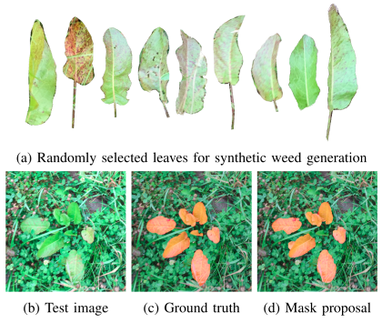

# Semi-automatic pixel-level annotation of grassland weeds

## Introduction
The WeedAnnotator is applied as following: (i) a human manually annotates a small number of leaves of the considered weed, 
(ii) the WeedAnnotator takes those annotated leaves and some weed-free background grassland images to generate synthetic training examples and train a deep learning model, 
(iii) the model is applied on the raw captured dataset and generates mask proposals for the weed plants, 
(iv) the annotator is manually checking the mask proposals and performs corrections or further annotations as needed.

The WeedAnnotator builds upon the assumption that the visual appearance of the plants belonging to a specific species, captured within one field and one day, has remarkable low variance.



The WeedAnnotator consists of the main steps.
1. __Synthetic data__ generation by pasting a small number of leaves in weed-free background images.
2. Mask prediction using a __semantic segmentation model__ (specifically PSP-Net with Resnet18 as backbone) trained on synthetic images only.
3. Mask quality improvements using __post-processing__ (mainly GrabCut[]).

## Usage
### Instalation
__Setting up the environment environment__
* Create virtual environment (python3)
    ```
    virtualenv <path_to_venv> --python=python3
    ```
* Install requirements
    ```
    <path_to_venv>/bin/pip3 install -r requirements.txt
    ```
### WeedAnnotator (full pipeline)
* The config _configs/weed_annotator.json_ defines the input data and output location of the full pipeline. By default,
data sample data from _sample_data_ is used. You can disable components and provide direct input.
* Run the following command to apply the full pipeline to you image data.
    ```
    <path_to_venv>/bin/python3 -m weed_annotator.full_pipeline.run_full_pipeline
    ```
### Individual Components

__Generation of synthetic data__

* Adapt the config _configs/image_composition.json_ to your images. (By default it will generate synthetic data using the sample_data)
* Run the following command to generate synetic data.
    ```
    <path_to_venv>/bin/python3 -m weed_annotator.image_composition.compose_imgs
    ```
* Annotations are saved in [CVAT format](https://github.com/openvinotoolkit/cvat/blob/develop/cvat/apps/documentation/xml_format.md).


__Post-processing predicted masks__
* Adapt the config _configs/post_processing.json_ to your predictions. (By default it will post-process sample predictions in sample_data)
* Run the following command to post-process your masks
    ```
    <path_to_venv>/bin/python3 -m weed_annotator.post_processing.post_process_masks
    ```

## Examples
(For better quality check the file _readme_content/example_mask_proposals.pdf_)


## Useful
* If you use CVAT (https://github.com/openvinotoolkit/cvat), you can transform the mask proposals in the appropriate
annotation format using the _AnnotationConverter_. The generated annotation file can be uploaded to CVAT in order to get 
your mask proposals in the webtool.
    ```
    AnnotationConverter.mask_to_cvat(<mask_folder>, <out_annotation_file>, <label_name>)
    ```
  
## Code References
* Lovasz Loss implementation: [https://github.com/bermanmaxim/LovaszSoftmax](https://github.com/bermanmaxim/LovaszSoftmax)
* pre-trained PSP-model: [https://github.com/qubvel/segmentation_models.pytorch](https://github.com/qubvel/segmentation_models.pytorch)
* Catalyst for training of PSP-model: [https://github.com/catalyst-team/catalyst](https://github.com/catalyst-team/catalyst)


