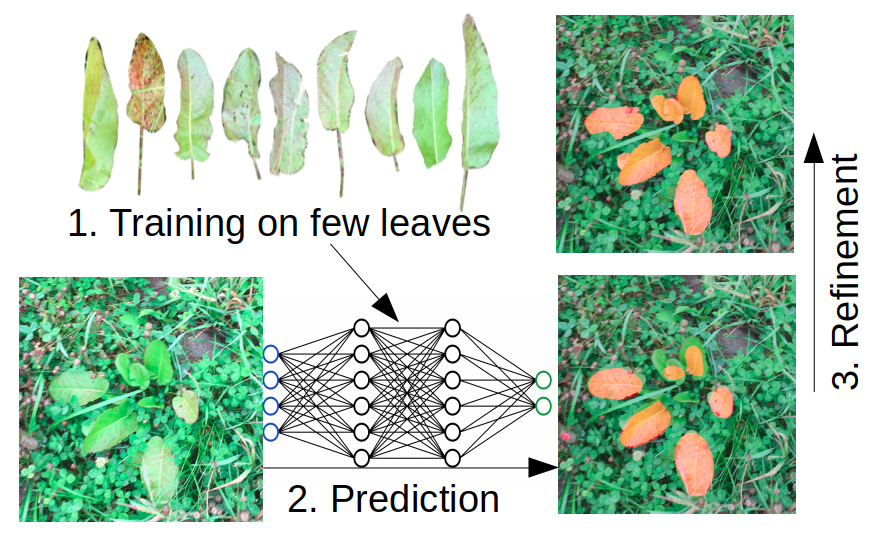
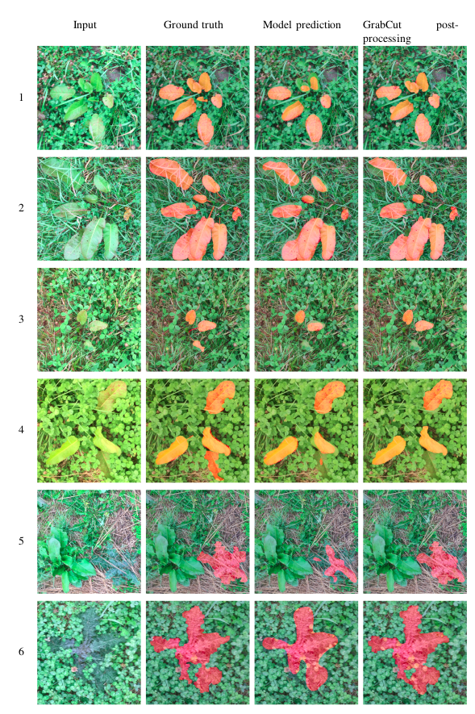

# Few-leaf Learning: Weed Segmentation in Grasslands
@ Conference on Intelligent Robots and Systems, IROS 2021

Abstract: Autonomous robotic weeding in grasslands requires robust weed segmentation. Deep learning models can provide solutions to this problem, but they need to be trained on large amounts of images, which in the case of grasslands are notoriously difficult to obtain and manually annotate. In this work we introduce Few-leaf Learning, a concept that facilitates the training of accurate weed segmentation models and can lead to easier generation of weed segmentation datasets with minimal human annotation effort. Our approach builds upon the fact that each plant species within the same field has relatively uniform visual characteristics due to similar environmental influences. Thus, we can train a field-and-day-specific weed segmentation model on synthetic training data stemming from just a handful of annotated weed leaves. We demonstrate the efficacy of our approach for different fields and for two common grassland weeds: Rumex obtusifolius (broad-leaved dock) and Cirsium vulgare (spear thistle). Our code is publicly available at https://github.com/RGring/WeedAnnotator.

[--> Paper Download](https://ieeexplore.ieee.org/document/9636770)

[--> Watch Video](https://www.youtube.com/watch?v=TtDEi8Y6S_E)

<p float="left">
   
</p>

## Usage
### Installation
__Setting up the environment__
* Create virtual environment (python3)
    ```
    virtualenv <path_to_venv> --python=python3
    ```
* Install requirements
    ```
    <path_to_venv>/bin/pip3 install -r requirements.txt
    ```
### Few-leaf Learning (full pipeline)
* The config _configs/weed_annotator.json_ defines the input data and output location of the full pipeline. By default,
data sample data from _sample_data_ is used. You can disable components and provide direct input.
* Run the following command to apply the full pipeline to you image data.
    ```
    <path_to_venv>/bin/python3 -m weed_annotator.full_pipeline.run_full_pipeline
    ```
### Individual Components

__Generation of synthetic data__

* Adapt the config _configs/image_composition.json_ to your images. (By default it will generate synthetic data using the sample_data)
* Run the following command to generate synetic data.
    ```
    <path_to_venv>/bin/python3 -m weed_annotator.image_composition.compose_imgs
    ```
* Annotations are saved in [CVAT format](https://github.com/openvinotoolkit/cvat/blob/develop/cvat/apps/documentation/xml_format.md).


__Post-processing predicted masks__
* Adapt the config _configs/post_processing.json_ to your predictions. (By default it will post-process sample predictions in sample_data)
* Run the following command to post-process your masks
    ```
    <path_to_venv>/bin/python3 -m weed_annotator.post_processing.post_process_masks
    ```

## Examples
(For better quality check the file _readme_content/example_mask_proposals.pdf_)


## Useful
* If you use CVAT (https://github.com/openvinotoolkit/cvat), you can transform the mask proposals in the appropriate
annotation format using the _AnnotationConverter_. The generated annotation file can be uploaded to CVAT in order to get 
your mask proposals in the webtool.
    ```
    AnnotationConverter.mask_to_cvat(<mask_folder>, <out_annotation_file>, <label_name>)
    ```
## Citation
If you find this work useful, please cite:
```
@INPROCEEDINGS{few_leaf_learning_2021,  
author={Güldenring, Ronja and Boukas, Evangelos and Ravn, Ole and Nalpantidis, Lazaros},
booktitle={2021 IEEE/RSJ International Conference on Intelligent Robots and Systems (IROS)},
title={Few-leaf Learning: Weed Segmentation in Grasslands},
year={2021}
}
```
## Code References
* Lovasz Loss implementation: [https://github.com/bermanmaxim/LovaszSoftmax](https://github.com/bermanmaxim/LovaszSoftmax)
* pre-trained PSP-model: [https://github.com/qubvel/segmentation_models.pytorch](https://github.com/qubvel/segmentation_models.pytorch)
* Catalyst for training of PSP-model: [https://github.com/catalyst-team/catalyst](https://github.com/catalyst-team/catalyst)


